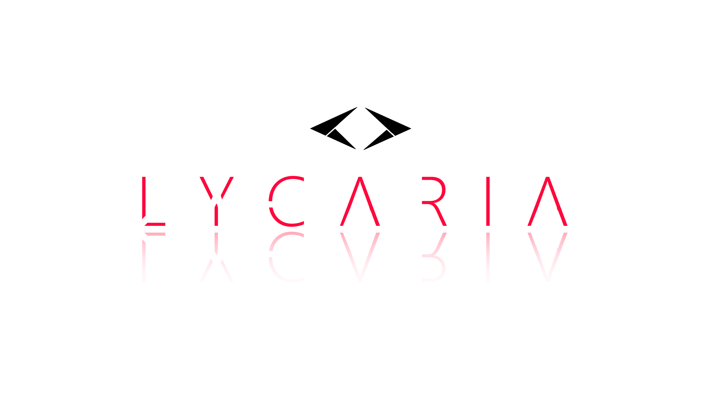

<h1 align="center">
   
    
   
    LYCARIA (FRONTEND | REACTRON) 👁️
   
</h1>

<h4 align="center">An online turn-based game (this repository concerns the client) created with <a href="https://pt-br.reactjs.org/" target="_blank">React</a> and <a href="https://www.electronjs.org/" target="_blank">Electron</a></h4>

  <a href="https://github.com/niloodev/lycaria-project-game/lycaria-art.pdf">ArtBook</a> •
  <a href="#proposal">Proposal</a> •
  <a href="#tools">Tools</a> •
  <a href="#author">Author</a>

  <a href="https://github.com/niloodev/lycaria-project-server">Server</a> •
  <a href="https://github.com/niloodev/lycaria-project-client">> Client (Reactron) <</a> •
  <a href="https://github.com/niloodev/lycaria-project-game">Game (Unity)</a>

> ☕ Developer: [niloodev](https://github.com/niloodev) • 🎨 Lead Designer: [Axel Galzz](https://twitter.com/axelgalzz) • 🐻 Animation and Pixel Designer: [VamnKuma](https://twitter.com/vamnkuma) • 🎵 Soundtrack: [Izábi Ferros](https://www.youtube.com/channel/UCzyddgAW2lqBUp_S6cy8ZJQ)

## Proposal
Project developed by; Ezequiel Nilo (Programming), Axel Galz (Design), VamnKuma (Animation and Pixel ART) and Izábi Ferros (Soundtrack).

Lycaria is a turn-based online game, it is divided in three parts; the client, server and the game. The project was developed with the intention of creating a simple and light form of entertainment for potential players, while developing a complex story behind it.

*The TCC (course conclusion project) was presented and delivered on 06/12/2021 as a project from Analysis and Systems Development technical course in ETEC Antônio de Pádua Cardoso.*

* The application must have CRUD functionalities, to POST and GET from [Lycaria Server](https://github.com/niloodev/lycaria-project-server).
* Be capable of supply all design limitations from [Lycaria Game | Unity](https://github.com/niloodev/lycaria-project-server), and open it when the match starts - passing all the necessary info.
* Have Register, Login and necessary screens along with the Player Dashboard and Match Creation.

## Tools

This application uses the following open-source packages:

##### Core ones.
- [Electron](https://www.electronjs.org/) (Page to executable framework)
- [React](https://pt-br.reactjs.org/) (Web "framework")

##### Stylization.
- [Material UI](https://mui.com/pt/) (CSS framework from Material Design to React)
- [SweetAlert2](https://sweetalert2.github.io/) (Popup library)
- [Framer Motion](https://www.framer.com/motion/) (Dynamic animation framework)

##### API requests and connection to server.
- [Colyseus (Client)](https://docs.colyseus.io/colyseus/) (Colyseus client, its like a WebSocket client)
- [Axios](https://axios-http.com/ptbr/docs/intro) (Library for CRUD functionalities)

## Author
**code made by niloodev | Ezequiel Nilo**

**ANY TIPS OR FEEDBACK IS HIGHLY APPRECIATED! 🐸**

